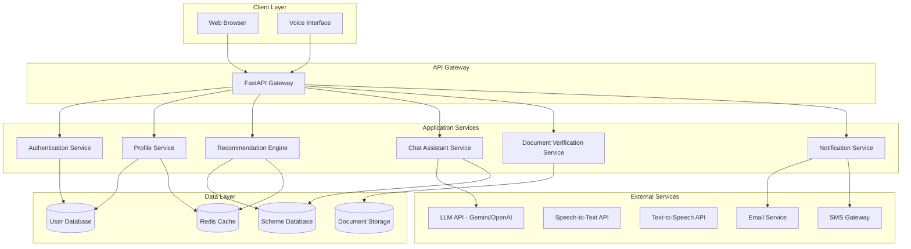

# Design Document: BharatAI Saathi Platform

## Overview

BharatAI Saathi is a full-stack web application that connects Indian citizens with government welfare schemes through AI-powered recommendations, document verification, and conversational assistance. The system consists of a FastAPI backend, a React-based frontend, an AI chat service, and supporting services for notifications and document processing.

The platform builds upon the existing recommendation engine (scoring-based matching) and extends it with a complete user interface, authentication, document verification, chat assistance, voice support, and notification capabilities.

## Architecture

### High-Level Architecture



### Technology Stack

**Backend:**
- FastAPI (Python 3.10+) - REST API framework
- Pydantic - Data validation
- SQLAlchemy - ORM for database operations
- PostgreSQL - Primary database for users and applications
- Redis - Caching and session management
- JWT - Authentication tokens

**Frontend:**
- React 18+ with TypeScript
- Tailwind CSS - Styling
- React Query - Data fetching and caching
- React Router - Navigation
- Zustand - State management
- Axios - HTTP client

**AI/ML Services:**
- Google Gemini API or OpenAI GPT-4 - Chat assistant
- Google Cloud Speech-to-Text - Voice input
- Google Cloud Text-to-Speech - Voice output
- Tesseract OCR - Document text extraction

**Infrastructure:**
- Docker - Containerization
- Nginx - Reverse proxy
- AWS S3 or similar - Document storage

## Components and Interfaces

### 1. API Gateway (FastAPI)

The central entry point for all client requests. Handles routing, authentication, and request validation.

**Key Endpoints:**

```python
# Authentication
POST /api/auth/register
POST /api/auth/login
POST /api/auth/refresh
POST /api/auth/logout
POST /api/auth/reset-password

# User Profile
GET /api/profile
PUT /api/profile
DELETE /api/profile

# Scheme Recommendations
POST /api/schemes/recommend
GET /api/schemes/{scheme_id}
GET /api/schemes/search

# Document Management
POST /api/documents/upload
GET /api/documents/{doc_id}
POST /api/documents/verify
DELETE /api/documents/{doc_id}

# Chat Assistant
POST /api/chat/message
GET /api/chat/history
POST /api/chat/voice

# Notifications
GET /api/notifications
PUT /api/notifications/{notif_id}/read
PUT /api/notifications/preferences

# Admin (future)
POST /api/admin/schemes
PUT /api/admin/schemes/{scheme_id}
DELETE /api/admin/schemes/{scheme_id}
```

**Request/Response Models:**

```python
# User Profile
class UserProfile(BaseModel):
    age: int = Field(ge=0, le=120)
    gender: str = Field(pattern="^(male|female|other)$")
    income: int = Field(ge=0)
    state: str
    category: str = Field(pattern="^(General|OBC|SC|ST|EWS)$")

# Scheme Recommendation Response
class SchemeRecommendation(BaseModel):
    scheme_id: str
    name: str
    description: str
    eligibility_score: int = Field(ge=0, le=100)
    benefits: List[str]
    required_documents: List[str]
    eligibility_criteria: Dict[str, Any]
    matched_criteria: List[str]
    unmatched_criteria: List[str]
    application_link: str

# Chat Message
class ChatMessage(BaseModel):
    message: str
    language: str = "en"
    voice_input: bool = False

class ChatResponse(BaseModel):
    response: str
    suggestions: List[str]
    related_schemes: List[str]
    timestamp: datetime
```

### 2. Authentication Service

Manages user registration, login, and session management using JWT tokens.

**Interface:**

```python
class AuthService:
    def register_user(email: str, password: str, phone: str) -> User
    def login(email: str, password: str) -> TokenPair
    def refresh_token(refresh_token: str) -> TokenPair
    def logout(user_id: str) -> bool
    def reset_password(email: str) -> bool
    def verify_token(token: str) -> User
```

**Security Features:**
- Password hashing using bcrypt
- JWT tokens with 24-hour expiration
- Refresh tokens with 7-day expiration
- Rate limiting on login attempts
- Account lockout after 5 failed attempts

### 3. Profile Service

Manages user profile data and triggers recommendation updates.

**Interface:**

```python
class ProfileService:
    def create_profile(user_id: str, profile: UserProfile) -> Profile
    def get_profile(user_id: str) -> Profile
    def update_profile(user_id: str, profile: UserProfile) -> Profile
    def delete_profile(user_id: str) -> bool
    def validate_profile(profile: UserProfile) -> ValidationResult
```

**Validation Rules:**
- Age: 0-120
- Income: >= 0
- State: Must be in valid Indian states list
- Category: Must be one of [General, OBC, SC, ST, EWS]
- Gender: Must be one of [male, female, other]

### 4. Recommendation Engine (Enhanced)

Extends the existing scoring algorithm with caching and detailed matching information.

**Interface:**

```python
class RecommendationEngine:
    def recommend_schemes(profile: UserProfile, limit: int = 20) -> List[SchemeRecommendation]
    def calculate_eligibility_score(profile: UserProfile, scheme: Scheme) -> int
    def get_matched_criteria(profile: UserProfile, scheme: Scheme) -> List[str]
    def get_unmatched_criteria(profile: UserProfile, scheme: Scheme) -> List[str]
    def search_schemes(query: str, profile: UserProfile) -> List[SchemeRecommendation]
```

**Scoring Algorithm (Existing):**

```
Total Score = Age Match (20) + Gender Match (15) + Income Match (25) + 
              State Match (20) + Category Match (20)

Age Match:
  - If age_min <= user.age <= age_max: 20 points
  - Else: 0 points

Gender Match:
  - If scheme.gender == "any" OR scheme.gender == user.gender: 15 points
  - Else: 0 points

Income Match:
  - If user.income <= scheme.income_max: 25 points
  - Else: 0 points

State Match:
  - If scheme.state == "all" OR scheme.state == user.state: 20 points
  - Else: 0 points

Category Match:
  - If scheme.category == "all" OR scheme.category == user.category: 20 points
  - Else: 0 points

Threshold: Only return schemes with score > 40
```

**Caching Strategy:**
- Cache scheme data in Redis with 1-hour TTL
- Cache user recommendations with 15-minute TTL
- Invalidate cache on profile update

### 5. Chat Assistant Service

Provides conversational AI interface using LLM (Gemini or GPT-4).

**Interface:**

```python
class ChatAssistant:
    def process_message(user_id: str, message: str, language: str) -> ChatResponse
    def get_chat_history(user_id: str, limit: int) -> List[ChatMessage]
    def process_voice_input(user_id: str, audio_data: bytes) -> ChatResponse
    def generate_voice_output(text: str, language: str) -> bytes
```

**Conversation Flow:**

```
1. User sends message
2. Retrieve user profile and chat history
3. Build context prompt with:
   - User profile information
   - Recent chat history (last 10 messages)
   - Available schemes matching user profile
4. Send to LLM with system prompt
5. Parse LLM response
6. Extract any scheme recommendations
7. Return formatted response with suggestions
```

**System Prompt Template:**

```
You are BharatAI Saathi, an AI assistant helping Indian citizens discover government schemes.

User Profile:
- Age: {age}
- Gender: {gender}
- Income: {income}
- State: {state}
- Category: {category}

Your role:
1. Help users understand their eligible schemes
2. Explain eligibility criteria in simple language
3. Guide users through application processes
4. Answer questions about benefits and requirements
5. Use simple, clear language suitable for all literacy levels

Available schemes for this user: {scheme_list}

Respond in {language}. Be helpful, friendly, and concise.
```

### 6. Document Verification Service

Handles document upload, storage, and AI-powered verification.

**Interface:**

```python
class DocumentVerifier:
    def upload_document(user_id: str, scheme_id: str, doc_type: str, file: UploadFile) -> Document
    def verify_document(doc_id: str) -> VerificationResult
    def get_document(doc_id: str) -> Document
    def delete_document(doc_id: str) -> bool
    def extract_text(file_path: str) -> str
    def validate_document_content(text: str, requirements: List[str]) -> ValidationResult
```

**Verification Process:**

```
1. Validate file format (PDF, JPG, PNG)
2. Check file size (<= 10MB)
3. Upload to secure storage (S3)
4. Extract text using OCR (Tesseract)
5. Use LLM to validate extracted text against requirements:
   - Check for required fields (name, date, ID numbers)
   - Verify document type matches requirement
   - Check for completeness
6. Return verification result with feedback
```

**Document Types:**
- Aadhaar Card
- PAN Card
- Income Certificate
- Caste Certificate
- Domicile Certificate
- Bank Passbook
- Ration Card
- Age Proof

### 7. Notification Service

Sends notifications via email, SMS, and in-app channels.

**Interface:**

```python
class NotificationService:
    def send_notification(user_id: str, notification: Notification) -> bool
    def check_new_schemes(user_id: str) -> List[Scheme]
    def send_bulk_notifications(scheme_id: str) -> int
    def get_user_notifications(user_id: str) -> List[Notification]
    def mark_as_read(notification_id: str) -> bool
    def update_preferences(user_id: str, preferences: NotificationPreferences) -> bool
```

**Notification Types:**
- New eligible scheme available
- Scheme deadline approaching
- Document verification complete
- Application status update

**Delivery Channels:**
- In-app notifications (always enabled)
- Email (configurable)
- SMS (configurable)

**Scheduling:**
- Check for new schemes: Daily at 9 AM
- Deadline reminders: 7 days, 3 days, 1 day before
- Batch processing to avoid overwhelming users

### 8. Voice Interface

Integrates speech-to-text and text-to-speech for accessibility.

**Interface:**

```python
class VoiceInterface:
    def speech_to_text(audio_data: bytes, language: str) -> str
    def text_to_speech(text: str, language: str) -> bytes
    def detect_language(audio_data: bytes) -> str
```

**Supported Languages:**
- English (en-IN)
- Hindi (hi-IN)

**Voice Flow:**
```
1. User clicks voice button
2. Browser captures audio
3. Send audio to backend
4. Convert speech to text (Google Speech-to-Text)
5. Process text through chat assistant
6. Convert response to speech (Google Text-to-Speech)
7. Return audio to frontend
8. Play audio response
```

## Data Models

### User Model

```python
class User(Base):
    __tablename__ = "users"
    
    id: UUID = Column(UUID(as_uuid=True), primary_key=True, default=uuid4)
    email: str = Column(String, unique=True, nullable=False)
    phone: str = Column(String, unique=True, nullable=False)
    password_hash: str = Column(String, nullable=False)
    created_at: datetime = Column(DateTime, default=datetime.utcnow)
    last_login: datetime = Column(DateTime)
    is_active: bool = Column(Boolean, default=True)
    failed_login_attempts: int = Column(Integer, default=0)
    locked_until: datetime = Column(DateTime, nullable=True)
    
    # Relationships
    profile: "Profile" = relationship("Profile", back_populates="user", uselist=False)
    documents: List["Document"] = relationship("Document", back_populates="user")
    notifications: List["Notification"] = relationship("Notification", back_populates="user")
    chat_messages: List["ChatMessage"] = relationship("ChatMessage", back_populates="user")
```

### Profile Model

```python
class Profile(Base):
    __tablename__ = "profiles"
    
    id: UUID = Column(UUID(as_uuid=True), primary_key=True, default=uuid4)
    user_id: UUID = Column(UUID(as_uuid=True), ForeignKey("users.id"), unique=True)
    age: int = Column(Integer, nullable=False)
    gender: str = Column(String, nullable=False)
    income: int = Column(Integer, nullable=False)
    state: str = Column(String, nullable=False)
    category: str = Column(String, nullable=False)
    language_preference: str = Column(String, default="en")
    updated_at: datetime = Column(DateTime, default=datetime.utcnow, onupdate=datetime.utcnow)
    
    # Relationships
    user: "User" = relationship("User", back_populates="profile")
```

### Scheme Model

```python
class Scheme(Base):
    __tablename__ = "schemes"
    
    id: UUID = Column(UUID(as_uuid=True), primary_key=True, default=uuid4)
    name: str = Column(String, nullable=False)
    description: str = Column(Text, nullable=False)
    age_min: int = Column(Integer, default=0)
    age_max: int = Column(Integer, default=100)
    gender: str = Column(String, default="any")
    income_max: int = Column(Integer, default=9999999)
    state: str = Column(String, default="all")
    category: str = Column(String, default="all")
    benefits: List[str] = Column(JSON, nullable=False)
    required_documents: List[str] = Column(JSON, nullable=False)
    application_link: str = Column(String, nullable=False)
    government_level: str = Column(String, nullable=False)  # Central, State, Local
    is_active: bool = Column(Boolean, default=True)
    created_at: datetime = Column(DateTime, default=datetime.utcnow)
    updated_at: datetime = Column(DateTime, default=datetime.utcnow, onupdate=datetime.utcnow)
```

### Document Model

```python
class Document(Base):
    __tablename__ = "documents"
    
    id: UUID = Column(UUID(as_uuid=True), primary_key=True, default=uuid4)
    user_id: UUID = Column(UUID(as_uuid=True), ForeignKey("users.id"))
    scheme_id: UUID = Column(UUID(as_uuid=True), ForeignKey("schemes.id"))
    document_type: str = Column(String, nullable=False)
    file_path: str = Column(String, nullable=False)
    file_size: int = Column(Integer, nullable=False)
    mime_type: str = Column(String, nullable=False)
    verification_status: str = Column(String, default="pending")  # pending, verified, rejected
    verification_feedback: str = Column(Text, nullable=True)
    uploaded_at: datetime = Column(DateTime, default=datetime.utcnow)
    verified_at: datetime = Column(DateTime, nullable=True)
    
    # Relationships
    user: "User" = relationship("User", back_populates="documents")
```

### Notification Model

```python
class Notification(Base):
    __tablename__ = "notifications"
    
    id: UUID = Column(UUID(as_uuid=True), primary_key=True, default=uuid4)
    user_id: UUID = Column(UUID(as_uuid=True), ForeignKey("users.id"))
    type: str = Column(String, nullable=False)  # new_scheme, deadline, verification, status
    title: str = Column(String, nullable=False)
    message: str = Column(Text, nullable=False)
    scheme_id: UUID = Column(UUID(as_uuid=True), ForeignKey("schemes.id"), nullable=True)
    is_read: bool = Column(Boolean, default=False)
    created_at: datetime = Column(DateTime, default=datetime.utcnow)
    
    # Relationships
    user: "User" = relationship("User", back_populates="notifications")
```

### ChatMessage Model

```python
class ChatMessage(Base):
    __tablename__ = "chat_messages"
    
    id: UUID = Column(UUID(as_uuid=True), primary_key=True, default=uuid4)
    user_id: UUID = Column(UUID(as_uuid=True), ForeignKey("users.id"))
    role: str = Column(String, nullable=False)  # user, assistant
    content: str = Column(Text, nullable=False)
    language: str = Column(String, default="en")
    created_at: datetime = Column(DateTime, default=datetime.utcnow)
    
    # Relationships
    user: "User" = relationship("User", back_populates="chat_messages")
```

## Correctness Properties

*A property is a characteristic or behavior that should hold true across all valid executions of a system—essentially, a formal statement about what the system should do. Properties serve as the bridge between human-readable specifications and machine-verifiable correctness guarantees.*

